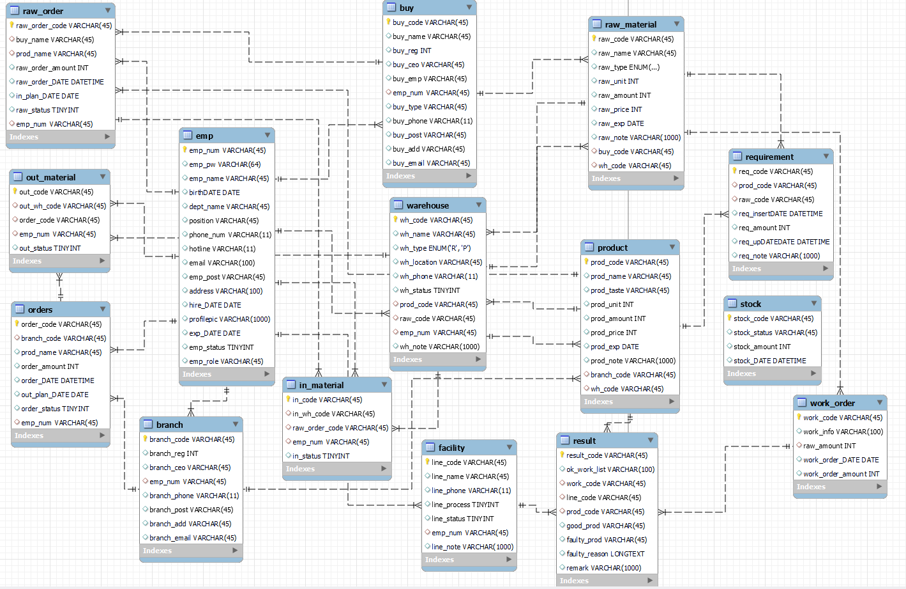

# ICEMILE — 웹 MES 시스템

아이스크림 공장의 **제조실행시스템(MES, Manufacturing Execution System)**. 원자재 발주부터
생산, 재고 관리, 완제품 출고까지의 공정 흐름을 하나의 웹 애플리케이션에서 통합 관리한다.

- **개발 기간**: 2023.09.19 ~ 2023.10.23 (5주)
- **인원**: 8명 팀 프로젝트
- **시연 영상**: <https://youtu.be/bnsg5h2zOf8>
- **요구사항 · DB 명세서**: [`docs/2차프로젝트_1조.xlsx`](docs/2차프로젝트_1조.xlsx) (요구사항 정의서 / 테이블 정의서 / 일정표) · [원본 Google Sheets](https://docs.google.com/spreadsheets/d/1XNlJWtk0NMtnhZQYz2LyskZZUtRB-scXsqfFb7-lcMI/edit?usp=sharing)

> 원래 Eclipse(STS) 기반으로 개발되었으며, 현재 IntelliJ IDEA 환경으로 이전했다.
> 개발 당시 JDK 1.7 → 현재 Java 11 로 빌드한다.

---

## 서비스 플로우

```
원자재 발주 → 원자재 입고 → 원자재 재고 반영 → 생산계획(소요량 산정) → 작업지시
   → 생산 진행(원자재 사용) → 생산 실적 등록 → 완제품 재고 반영 → 수주 → 출고 처리
```

---

## 기술 스택

| 구분 | 사용 기술 |
|------|-----------|
| Language / Build | Java 11, Maven, WAR 패키징 |
| Framework | Spring Framework 4.3.8 (Legacy MVC, XML 설정), Spring Security 5.5 |
| Persistence | MyBatis 3.4.1, mybatis-spring, Spring JDBC |
| Database | MySQL 8, HikariCP 커넥션풀, log4jdbc-log4j2 (SQL 로깅) |
| View | JSP + JSTL, jQuery |
| AOP | AspectJ (세션 · 권한 제어) |
| 실시간 | Spring WebSocket + SockJS (사내 채팅) |
| 보안 | BCryptPasswordEncoder(비밀번호 해시), Naver Lucy XSS Servlet Filter |
| 파일 | Apache Commons FileUpload / Commons IO |
| 기타 | Lombok, Jackson (JSON) |
| Logging | SLF4J + Log4j 1.2 |
| WAS | Apache Tomcat 8.x ~ 9.x (Servlet 2.5, `javax.*`) |

> ⚠️ Servlet API가 `javax.*` 네임스페이스이므로 **Tomcat 10 이상(`jakarta.*`)에서는 동작하지 않는다.** Tomcat 9.0.x 를 사용할 것.

---

## 아키텍처

**계층 구조**

```
Controller  →  Service (인터페이스 + Impl)  →  DAO (인터페이스 + Impl)  →  MyBatis Mapper XML  →  MySQL
```

- 화면(JSP) 반환 컨트롤러 `/{도메인}/*` 와 JSON 응답 Ajax 컨트롤러 `/{도메인}_ajax/*` 를 분리했다.
- 도메인 코드 값은 **Enum** 으로 관리: `Department`(부서), `Position`(직급), `ProOrderStatus`(수주 상태), `Product`(완제품 종류), `RawMaterial`(원자재 종류).

**AOP (`ems.icemile.handler`)**

| Aspect | 대상 | 동작 |
|--------|------|------|
| `SessionHandler` | `ems.icemile.controller..*Controller` 의 모든 메서드 (`@UnUseAOP` 제외) | 세션에 `emp_num` 이 없으면 로그인 예외 발생 |
| `AccessHandler` | `@Departments` · `@Business` · `@Production` · `@Logistics` 어노테이션이 붙은 메서드 | 세션 `emp_role`(4자리 문자열, 자리별 인사/영업/생산/물류 권한)을 검사해 권한 없으면 예외 발생 |

**인증**

- 로그인: `MemberController` `POST /member/login` → `MemberService.userCheck()` 가 `BCryptPasswordEncoder.matches()` 로 비밀번호 검증 → 성공 시 세션에 `emp_num`, `emp_role` 저장.
- 로그인/아이디찾기 등 인증 불필요 메서드에는 `@UnUseAOP` 를 붙여 세션 AOP를 우회한다.

---

## 모듈 및 URL 맵

| 도메인 | 화면 URL | Ajax URL | 뷰 폴더 | 설명 |
|--------|----------|----------|---------|------|
| 회원/사원 | `/member/*` | `/member_ajax/*` | `views/member` | 로그인, 사원 등록·수정(관리자), 사내 채팅 |
| 메인 | `/main/*` | — | `views/main` | 대시보드, 401/404/500 에러 페이지 |
| 원자재 발주 | `/buy/*` | `/buy_ajax/*` | `views/buy` | 발주 등록·수정, 발주서 |
| 발주 목록 | `/buyOrder/*` | — | `views/buyOrder` | 발주 내역 조회 |
| 창고(원자재) | `/warehouse/*` | `/warehouse_ajax/*` | `views/warehouse` | 원자재 입·출고, 재고 |
| 공장 | `/factory/*` | `/factory_ajax/*` | `views/factory` | 설비(facility), 소요량(requirement), 작업지시(workOrder) |
| 본사 | `/head/*` | `/head_ajax/*` | `views/head` | 생산 실적(result), 완제품 재고(stock) |
| 완제품 | `/product/*` | `/product_ajax/*` | `views/product` | 완제품 관리 |
| 수주 | `/sell/*` | `/sell_ajax/*` | `views/sell` | 수주 등록·조회 |
| 출고 | `/shipping/*` | `/Shipping_ajax/*` | `views/shipping` | 완제품 출고 처리 |
| 차트 | — | `/chart_ajax/*` | — | 생산·재고 통계 |
| 캘린더 | — | `/calendar_ajax/*` | — | 일정 |
| 채팅 | — | `ws://…/chat` (SockJS) | — | 실시간 사내 메신저 |

> `*CopyController` / `*Copy2Controller` 등 `Copy` 접미사 클래스는 개발 과정에서 만든 대체 구현본이다.

---

## 데이터베이스

MySQL 8, 스키마명 `icemile`, 문자셋 `utf8mb4` / `utf8mb4_0900_ai_ci`.
원본 덤프(스키마 + 샘플 데이터): [`docs/icemile_schema.sql`](docs/icemile_schema.sql)

### ERD



> ERD는 설계 시점 기준이라 최종 DB와 일부 차이가 있다 — 실제 덤프에는 작업지시가 `work_order`(빈 테이블) 대신
> `test_work_order`(`order_code` → `orders` FK, `ON DELETE CASCADE`)로 들어가 있고, MyBatis 매퍼도 그쪽을 쓴다.

| 테이블 | 의미 | PK | 비고 |
|--------|------|-----|------|
| `emp` | 사원(로그인 계정) | `emp_num` | `emp_pw` = BCrypt 해시, `emp_role` = 4자리 권한 문자열(인사·영업·생산·물류), `dept_name`/`position` = Enum 값 |
| `branch` | 지점(대리점) — 수주처 | `branch_code` | `emp_num` = 담당 영업사원 |
| `buy` | 매입처(원자재 공급업체) | `buy_code` | `buy_type` = 취급 원자재 |
| `raw_material` | 원자재 마스터 | `raw_code` | `raw_type` = enum(우유·크림·설탕·파우더·조미료) |
| `product` | 완제품 마스터 | `prod_code` | `prod_taste` = 맛 |
| `raw_order` | 원자재 발주 | `raw_order_code` | `raw_status` = 진행 상태 |
| `in_material` | 원자재 입고 | `in_code` | `raw_order_code` 참조, `in_status` |
| `warehouse` | 창고 | `wh_code` | `wh_type` = enum('R' 원자재 / 'P' 완제품) |
| `stock` | 재고(원자재·완제품 공용) | `stock_code` | `prod_code` 또는 `raw_code` 중 하나 |
| `requirement` | 소요량(BOM) — 완제품:원자재 배합 | `req_code` | `prod_code` + `raw_code` |
| `test_work_order` | 작업지시 **(실사용)** | `work_code` | `order_code` → `orders` FK (`ON DELETE CASCADE`), `line_process` = 공정 단계 |
| `work_order` | 작업지시 (구버전, 미사용·빈 테이블) | `work_code` | — |
| `result` | 생산 실적 | `result_code` | `good_prod`/`faulty_prod` = 양품/불량 수량, `faulty_reason` |
| `facility` | 생산 설비/라인 | `line_code` | `line_process` 공정, `line_status` 가동 상태 |
| `orders` | 수주(주문) | `order_code` | `branch_code` 참조, `order_status` |
| `out_material` | 완제품 출고 | `out_code` | `order_code` + `stock_code` 참조 |
| `user` | (미사용) 초기 Spring Security JDBC 인증 흔적 | — | 매퍼에서 참조 안 함, 데이터 없음 |

> 외래키는 `test_work_order → orders` 하나만 실제로 걸려 있고, 나머지 테이블은 코드(varchar 코드값)로 느슨하게 연결한다.

### 상태 코드값 (명세서 기준)

| 컬럼 | 테이블 | 값 |
|------|--------|-----|
| `emp_role` | `emp` | 2진수 4자리, 자리 순서 = **인사 · 영업 · 생산 · 물류**, `1` 권한 있음 / `0` 없음. `1111` = 전권(관리자). 세션 `emp_role` 에 저장, AOP가 자리별로 검사 |
| `emp_status` | `emp` | `0` 재직중 / `1` 휴직중 / `2` 퇴사 (default 0) |
| `order_status` | `orders` (수주) | `1` 대기중 / `2` 생산중 / `3` 생산완료 / `4` 납품완료 — `enums.ProOrderStatus` 와 일치 |
| `raw_status` | `raw_order` (발주) | `1` 발주중 / `2` 발주확정 |
| `in_status` | `in_material` (입고) | `1` 입고전 / `2` 입고중 / `3` 입고확정 |
| `out_status` | `out_material` (출고) | `1` 출고전 / `2` 출고중 / `3` 출고확정 |
| `line_process` | `facility` | `1` 1차공정 / `2` 2차공정 / `3` 3차공정 |
| `line_status` | `facility` | `1` 가동중 / `2` 대기중 / `3` 고장 |
| `wh_type` | `warehouse` | enum `R` 원자재 / `P` 완제품 |
| `wh_status` | `warehouse` | `Y` 사용가능 / `N` 비활성 |
| `raw_type` | `raw_material` | enum 우유 / 크림 / 설탕 / 파우더 / 조미료 (+포장) |
| `dept_name` · `position` | `emp` | `enums.Department` (관리자·인사·영업·생산·물류), `enums.Position` (관리자·사원·대리·과장·차장·부장) |

### 코드(PK) 생성 규칙

| 대상 | 규칙 | 예시 |
|------|------|------|
| 사원 | `IM` + 6자리 시퀀스 | `IM000001` |
| 원자재 / 완제품 / 소요량 / 재고 / 실적 | 접두문자 + 4자리 | `R0001` · `P0001` · `RE0001` · `ST0001` · `RS0001` |
| 매입처 / 지점 | `BU`/`BR` + 4자리 | `BU0001` · `BR0001` |
| 생산라인 | 공정별 접두 + 4자리 | 생산 `PR0001` · 검수 `IN0001` · 포장 `PA0001` |
| 발주 | `OB` + YYMMDD + `_` + seq | `OB231020_15` |
| 수주 | `OS` + YYMMDD + 지점코드 + `_` + seq | `OS231020BR3_3` |
| 입고 | `IN` + YYMMDD + `_` + 거래처번호 + `_` + 4자리 | `IN231020_1_0006` |
| 출고 | `OUT` + YYMMDD + `_` + seq | `OUT231020_3_0001` |

### 요구사항 모듈 ID (명세서)

`EMP1`(사용자추가·인사) · `EMP2`(로그인·마이페이지) · `PR3`(물품등록) · `RAW4`(원자재) · `PRO5`(완제품) ·
`RE6`(소요량) · `FA7`(설비) · `WH8`(창고) · `BUY9`(매입처) · `BR10`(지점) · `OB11`(발주) · `OS12`(수주) ·
`IM13`(입고) · `OM14`(출고) · `WO15`(작업지시) · `RS`(생산실적) · `ST17`(재고)

---

## 프로젝트 구조

```
icemileProject/
├─ pom.xml
└─ src/main/
   ├─ java/ems/icemile/
   │  ├─ home/           HomeController (루트 "/" 매핑)
   │  ├─ controller/     화면 · Ajax 컨트롤러 (28개)
   │  ├─ service/        서비스 인터페이스 + Impl (28개)
   │  ├─ dao/            DAO 인터페이스 + Impl (28개)
   │  ├─ dto/            요청·응답 DTO (23개)
   │  ├─ enums/          도메인 코드 Enum (5개)
   │  ├─ annotation/     AOP 마커 어노테이션 (Business/Departments/Production/Logistics/UnUseAOP)
   │  └─ handler/        AOP Aspect(Session/Access) + WebSocket ChatHandler
   ├─ resources/
   │  ├─ mappers/        MyBatis Mapper XML (18개, SQL 약 142개)
   │  ├─ mybatis-config.xml
   │  ├─ log4j.xml / log4jdbc.log4j2.properties
   │  └─ lucy-xss-servlet-filter-rule.xml
   └─ webapp/
      ├─ WEB-INF/
      │  ├─ web.xml                         필터(인코딩·XSS·Multipart), DispatcherServlet, 에러 페이지
      │  ├─ spring/root-context.xml         DataSource, HikariCP, SqlSessionFactory, MultipartResolver, PasswordEncoder
      │  ├─ spring/appServlet/servlet-context.xml   MVC, 뷰 리졸버, component-scan, WebSocket, AOP
      │  └─ views/                          JSP 화면 (72개)
      └─ resources/                         정적 자원 (css / js / assets)
```

---

## 로컬 실행 방법

### 사전 준비

- **JDK 11**
- **MySQL 8**
- **Apache Tomcat 9.0.x** (10 이상 불가)
- **IntelliJ IDEA** (Tomcat 실행 구성을 위해 Ultimate 권장)

### 1. 데이터베이스

```bash
mysql -u root -p -e "CREATE DATABASE icemile DEFAULT CHARACTER SET utf8mb4 COLLATE utf8mb4_0900_ai_ci;"
mysql -u root -p icemile < docs/icemile_schema.sql
```

`docs/icemile_schema.sql` 는 팀 프로젝트 RDS에서 추출한 스키마 + 샘플 데이터 덤프다.
샘플 계정: `admin` / (BCrypt 해시만 있고 평문 비밀번호는 미상 — 필요 시 새 해시로 `UPDATE`).

### 2. DB 접속 정보 수정

`src/main/webapp/WEB-INF/spring/root-context.xml` 의 `hikariConfig` 빈에서
`jdbcUrl` · `username` · `password` 를 로컬 환경에 맞게 수정한다.

```xml
<property name="jdbcUrl"  value="jdbc:log4jdbc:mysql://localhost:3306/icemile?allowMultiQueries=true&amp;serverTimezone=Asia/Seoul&amp;characterEncoding=UTF-8"/>
<property name="username" value="root"/>
<property name="password" value="본인_비밀번호"/>
```

### 3. IntelliJ 설정

1. `File → Open` 에서 `icemileProject/pom.xml` 선택 → **Open as Project**
2. Maven 프로젝트 Reload, `Project Structure` 에서 SDK = **11**, Language level = **11**
3. `File Encodings` 를 모두 **UTF-8** 로 설정 (한글 소스·JSP)

### 4. Tomcat 실행 구성

1. `Settings → Build, Execution, Deployment → Application Servers` 에 Tomcat 9 등록
2. `Run → Edit Configurations → + → Tomcat Server → Local`
   - **Deployment**: `home:war exploded` 추가, Application context = `/`
   - **Server**: JRE = 11, 포트 8080
3. 실행 후 <http://localhost:8080/> 접속 → 미로그인 시 `/member/login` 으로 이동

---

## 담당 역할

포트폴리오 작성자(허수연) 담당 범위: 회의록 문서화(서기), 화면 설계, 화면(웹 UI) 퍼블리싱 및 개발.
